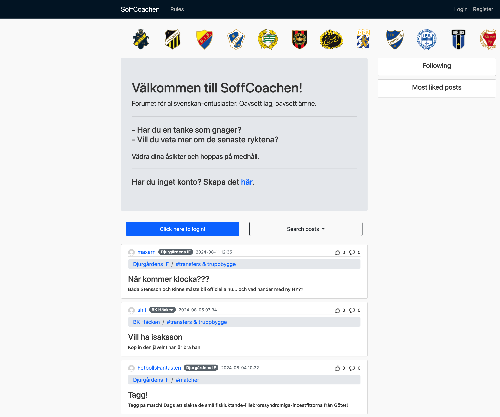

# 🏟️ **Soffcoachen** — *A Web-Based Discussion Forum for Football Enthusiasts*  

Engage in passionate discussions, share insights, and stay up-to-date with the latest in football — all in one place. **Soffcoachen** provides a lightweight, fast, and secure platform for football lovers to connect in real time.  

---

## 💼**Current work**

- [ ] Finishing up deployment-switch to AWS (Changed from Azure)
  - [ ] Configure storage location to save new profile pictures
  - [x] HTTPS and domain registration
- Secure against OWASP Top 10
  - [ ] Implement path-traversal validation on picture upload
  - [ ] mask "hidden" path requests
- Extending functionality
  - [ ] add external API for allsvenskan standings
  - [ ] change teams
  - [ ] add 'superettan'

---

## 🚀 **Features**
- 💬 **Real-Time Discussions**: Chat with other football enthusiasts on the hottest topics.  
- 🔐 **Secure & Scalable**: Built with security-first principles using AWS services and industry best practices.  
- ⚡ **Blazing Fast**: Powered by a lightweight frontend and efficient backend, ensuring optimal performance.  
- 📈 **Always On**: Deployed on AWS with full systemd support for seamless uptime.

---

## 🛠️ **Tech Stack & Tools**
| **Category**         | **Technology / Tool**                             |
|---------------------|---------------------------------------------------|
| **🖥️ Backend**      | [Flask](https://flask.palletsprojects.com/) — Server-side logic & API development |
| **🌐 Frontend**     | **HTML / CSS / Vanilla JavaScript** — Clean, lightweight UI |
| **⚙️ Reverse Proxy**| **Nginx** — Reverse proxy for better security, caching, and performance |
| **☁️ Deployment**   | **AWS** — Scalable and secure cloud hosting with:  |
|                     | - **EC2** — Compute power for the application server |
|                     | - **RDS** — Managed database for persistent storage |
|                     | - **Secrets Manager** — Secure storage of sensitive data |
| **🗄️ Database**     | **PostgreSQL** — Reliable, scalable relational database |
| **🌀 Process Mgmt** | **Systemd** — Service to manage Gunicorn & keep it running |
| **📜 Logging**      | **Journald** — Real-time logging for error tracking & debugging |
| **📦 Version Control**| **Git** — For version control, collaboration, and deployment pipelines |

---

## 📦 **Installation & Setup**

1️⃣ **Clone the repository**  
```bash
git clone https://github.com/mxwilen/soffcoachen.git
cd soffcoachen
```

2️⃣ **Set up your environment variables (optional)**  
Create a `.env` file at the root of the project with the following structure if you wish to connect to deploy host

3️⃣ **Run the bash script (will install reqs etc.)**  
```bash
sh start.sh
```
The app will be available at **http://127.0.0.1:5000**.


---

## 🚀 **Deployment Instructions**

1. **Server Setup**: Provision an AWS EC2 instance with the required security groups.  
2. **Deploy the App**: Glone the repo 
   ```bash
   git pull origin <BRANCH>
   ```

3. **Set up Gunicorn and Nginx**:  
   - Configure **Nginx** as a reverse proxy.  
   - Run **Gunicorn** using the script i wrote: `start.sh`  

4. **Manage with systemd**:  

5. **Reload and Start the Service**  

---

## 🌐 **Project Structure**
```bash
soffcoachen/
├── app/
│   ├── __init__.py             # Application factory, initializes extensions, and blueprints
│   ├── aws_conn.py             # AWS connection logic (for RDS, Secrets Manager, etc.)
│   ├── config_blueprints.py    # Blueprint configuration for Flask routes
│   ├── config_data.py          # Configuration for app data and constants
│   ├── config_logging.py       # Logging configuration for the application
│   ├── extensions.py           # Flask extensions (like SQLAlchemy, Loggin Manager, etc.)
│   ├── forms.py                # Flask-WTF forms for user input
│   ├── models.py               # SQLAlchemy models for the app's database
│   ├── routes/                 # Contains route definitions (modularized by type)
│   │   ├── __init__.py         # Initializes and registers all routes
│   │   ├── ajax_routes.py      # Routes for AJAX requests
│   │   ├── api_routes.py       # API endpoints (NOT IN USE)
│   │   ├── auth_routes.py      # Authentication routes (login, logout, registration, etc.)
│   │   ├── error_routes.py     # Custom error pages (404, 500, etc.)
│   │   ├── no_auth_routes.py   # Publicly accessible routes (no authentication required)
│   │   ├── routes.py           # Main routes (NOT IN USE)
│   │   └── utils.py            # Utility functions used within routes
│   ├── static/                 # Static files (CSS, images, fonts, etc.)
│   └── templates/              # HTML templates for the routes
├── venv/                       # Virtual environment — not committed
├── .env                        # Environment variables — not committed
├── requirements.txt            # Python dependencies for the project
├── start.sh                    # Script to start the application
└── README.md                   # You're looking at it now!
```
---

## 📸 **Screenshots**


*The homepage where users can join the hottest football discussions.*

  
*Discussion page showing real-time conversation threads.*

<!--
---

## 🧪 **Testing**
Run tests to ensure everything is working as expected.  
```bash
pytest
```

---

## 🤝 **Contributing**
We welcome contributions from the community! To get started:  
1. **Fork this repo**  
2. **Create a new branch** (`git checkout -b feature/your-feature-name`)  
3. **Commit your changes** (`git commit -m 'Add some feature'`)  
4. **Push to the branch** (`git push origin feature/your-feature-name`)  
5. **Create a Pull Request**  

---

## 📜 **License**
This project is licensed under the **MIT License**. See the [LICENSE](./LICENSE) file for details.

---

## 🙌 **Acknowledgements**
- **Flask** — For its simplicity and flexibility.  
- **AWS** — For hosting and cloud services.  
- **You** — For checking out this project!  
-->
---

**Made with ❤️ by Football Fans, for Football Fans** ⚽  

If you like this project, give it a ⭐ on GitHub!  
🚀 **[View the Live App](#)** | 📘 **[Documentation](#)** | 🐛 **[Report a Bug](#)**
